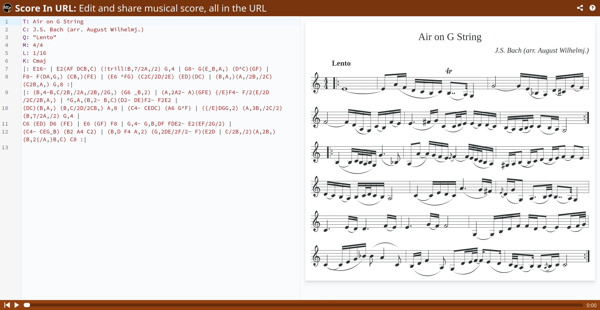

# Score In URL



**Score In URL** lets you write your sheet music in [ABC Notation](https://abcnotation.com/), and share it through a URL, where all the information is self-contained. It's heavily inspired by the great project: [Hashify](https://hashify.me/), which does the same thing with Markdown documents.

**Score In URL** privacy-friendly, as there is nothing stored on a remote server. This website is, in fact, hosted on GitHub Pages, with no backend whatsoever.

**Score In URL** is free and open source, under the [MIT license](https://raw.githubusercontent.com/PowerSnail/ScoreInUrl/main/LICENSE). You can find the source code on [GitHub](https://github.com/PowerSnail/ScoreInUrl).

## ABC Notation

ABC Notation is a way to write sheet music with plain text. You can learn more about it, by reading the [full documentation](https://abcnotation.com/wiki/abc:standard:v2.1), or use this [cheat sheet](http://www.stephenmerrony.co.uk/uploads/ABCquickRefv0_6.pdf) as a quick reference.

## Examples

[Bach Partita 3 Preludio](https://powersnail.com/ScoreInUrl?s=VDogUGFydGl0YSBJSUkgLSBQcmVsdWRpbwpDOiBKLlMuIEJhY2gKUTogMS80PTEyMApNOiAzLzQKTDogMS8xNgpLOiBFbWFqCnoyIGUnZCcgZScyYjJnMmIyIHwgKGVmZWQgZTIpQjJHMkIyIHwgRUJGQiBHQkFCIEdCRkIgfApFZWRjIEJlZGMgQkFHRiAgICB8IEVCRkIgR0JBQiBHQkZCICB8IEVlZGMgQmVkYyBCQUdGIHwKRUZHQSBCY2RlIGZnYWYgICAgfCBnYmVmIGdhYmMnIGQnZSdjJ2QnICB8IGUnYmFiIGdiYWIgZ2JmYiB8CmVlJ2QnYycgYmVjJ2UgYmVhZXwgZ2JmYiBnYmFiIGdiZmIgIHwgZWUnZCdjJyBiZWMnZSBiZWFlIHwKZ2VlZWRlZWVmZWRlIHwgZWVnZWZlZ2VhZWZlIHwgZ2VlZWRlZWVmZWRlIHwKZWVnZWZlZ2VhZWZlIHwgZ2VnZSBnZWdlIGdlZ2UgfCBnZWdkIGdlZ2QgZ2VnZCB8CmdlZz1kIGdlZ2QgZ2VnZCB8IGFlYWMgYWVhYyBhZWFjIHwgYWVhQiBhZWFCIGFlYUIgfApnZWdCIGdlZ0IgZ2VnQiB8IGdlZ0EgZ2VnQSBnZWdBIHwgZmVmQSBmZWZBIGZlZkEgfApmZWZHIGZlZkcgZmVmRyB8IGVlZUcgZWVlRyBlZWVHIHwgZWVlRiBlZWVGIGVlZUYgfApkZWRGIGRlZEYgZGVkRiB8IEVGRUYgR0JFRiBHQkVGIHwgR0FHQSBCZUdBIEJlR0EgfA%3D%3D)

[A simple C Major scale](https://powersnail.com/ScoreInUrl?s=VDogQyBNYWpvciBTY2FsZQpMOiAxLzE2Ck06IDIvNApDMkRFIEZHQUIgfCBjMmRlIGZnYWIgfCBjJzJiYSBnZmVkIHwgYzJCQSBHRkVEIHwgQzg%3D)

[Air on G String](https://powersnail.com/ScoreInUrl?s=VDogQWlyIG9uIEcgU3RyaW5nCkM6IEouUy4gQmFjaCAoYXJyLiBBdWd1c3QgV2lsaGVsbWouKQpROiAiTGVudG8iCk06IDQvNApMOiAxLzE2Cks6IENtYWoKfDogRTE2LSB8IEUyKEFGIERDQixDKSAoIXRyaWxsIUIsNy8yQSwvMikgRyw0IHwgRzgtIEcoRV9CLEEsKSAoRF5DKShHRikgfCAKRjgtIEYoREEsRywpIChDQiwpKEZFKSB8IChFNiBeRkcpIChDMkMvMkQvMkUpIChFRCkoREMpIHwgKEIsQSwpKEEsLzJCLC8yQykgKEMyQixBLCkgRyw4IDp8IAp8OiAoQiw0LUIsQy8yQiwvMkEsLzJCLC8yRywpIChHNiBfQiwyKSB8IChBLDJBMi0gQSkoR0ZFKSB7L0V9RjQtIEYvMihFLzJELzJDLzJCLEEsKSB8IF5HLEEsKEIsMi0gQixDKShEMi0gREUpRjItIEYyRTIgfAooREMpKEIsQSwpIChCLEMvMkQvMkNCLCkgQSw4IHwgKEM0LSBDRURDKSAoQTYgR15GKSB8ICh7L0V9REdHLDIpIChBLDNCLC8yQy8yKSAoQiw3LzJBLC8yKSBHLDQgfCAKQzYgKEVEKSBENiAoRkUpIHwgRTYgKEdGKSBGOCB8IEcsNC0gRyxCLERGIEZERTItIEUyKEVGLzJHLzIpIHwgCihDNC0gQ0VHX0IpIChCMiBBNCBDMikgfCAoQixEIEY0IEEsMikgKEcsMkRFLzJGLzItIEYpKEUyRCB8IEMvMkIsLzIpKEEsMkIsKSAoQiwyey9BLH1CLEMpIEM4IDp8Cg%3D%3D)

## Running and Developing _Score In URL_

Dependencies:

- [Abcjs](https://www.abcjs.net/)
- [CodeMirror](https://codemirror.net/)
- [Vite](https://vitejs.dev/)
- [Tailwind CSS](https://tailwindcss.com/)
- [TypeScript](https://www.typescriptlang.org/)

To start a testing server:

```sh
npm run dev
```

To run a production version of Score In URL, build the project, and host the destination directory as static files, with basically any server.

```sh
npm run build
```

If you'd like to host this project on a sub-path, like I do on [https://powersnail.com/ScoreInUrl](https://powersnail.com/ScoreInUrl/), supply the build command with a base URL, otherwise, the internal links will not point to the correct address.

```sh
npm run build -- --base=/subpath/
```

Currently, I'm hosting with GitHub Pages, by pushing the destination folder to a separate branch `dist`, and pointing GitHub Pages to that branch.

## Acknowledgement

My utmost gratefulness to [Hashify](https://hashify.me/) for the inspiration. And special thanks to [Hero icons](https://heroicons.com/) for all the icons on this site.